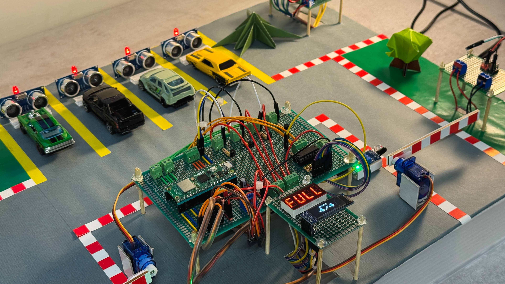

# PicoPark

[![Electronics](https://img.shields.io/badge/Electronics-B03931?style=flat&logo=data:image/svg+xml;base64,PCFET0NUWVBFIHN2ZyBQVUJMSUMgIi0vL1czQy8vRFREIFNWRyAxLjEvL0VOIiAiaHR0cDovL3d3dy53My5vcmcvR3JhcGhpY3MvU1ZHLzEuMS9EVEQvc3ZnMTEuZHRkIj4KDTwhLS0gVXBsb2FkZWQgdG86IFNWRyBSZXBvLCB3d3cuc3ZncmVwby5jb20sIFRyYW5zZm9ybWVkIGJ5OiBTVkcgUmVwbyBNaXhlciBUb29scyAtLT4KPHN2ZyB3aWR0aD0iODAwcHgiIGhlaWdodD0iODAwcHgiIHZpZXdCb3g9IjAgMCAyNCAyNCIgaWQ9IkxheWVyXzEiIGRhdGEtbmFtZT0iTGF5ZXIgMSIgeG1sbnM9Imh0dHA6Ly93d3cudzMub3JnLzIwMDAvc3ZnIiBmaWxsPSIjMDAwMEZGRkZGRiIgc3Ryb2tlPSIjMDAwMEZGRkZGRiI+Cg08ZyBpZD0iU1ZHUmVwb19iZ0NhcnJpZXIiIHN0cm9rZS13aWR0aD0iMCIvPgoNPGcgaWQ9IlNWR1JlcG9fdHJhY2VyQ2FycmllciIgc3Ryb2tlLWxpbmVjYXA9InJvdW5kIiBzdHJva2UtbGluZWpvaW49InJvdW5kIi8+Cg08ZyBpZD0iU1ZHUmVwb19pY29uQ2FycmllciI+Cg08ZGVmcz4KDTxzdHlsZT4uY2xzLTF7ZmlsbDpub25lO3N0cm9rZTojZmZmZmZmO3N0cm9rZS1taXRlcmxpbWl0OjEwO3N0cm9rZS13aWR0aDoxLjkycHg7fS5jbHMtMntmaWxsOiNmZmZmZmY7fTwvc3R5bGU+Cg08L2RlZnM+Cg08cmVjdCBjbGFzcz0iY2xzLTEiIHg9IjUuMjkiIHk9IjUuMjkiIHdpZHRoPSIxMy40MiIgaGVpZ2h0PSIxMy40MiIgcng9IjIuMjQiLz4KDTxsaW5lIGNsYXNzPSJjbHMtMSIgeDE9IjcuMjEiIHkxPSIwLjUiIHgyPSI3LjIxIiB5Mj0iNS4yOSIvPgoNPGxpbmUgY2xhc3M9ImNscy0xIiB4MT0iMTIiIHkxPSIwLjUiIHgyPSIxMiIgeTI9IjUuMjkiLz4KDTxsaW5lIGNsYXNzPSJjbHMtMSIgeDE9IjE2Ljc5IiB5MT0iMC41IiB4Mj0iMTYuNzkiIHkyPSI1LjI5Ii8+Cg08bGluZSBjbGFzcz0iY2xzLTEiIHgxPSI3LjIxIiB5MT0iMTguNzEiIHgyPSI3LjIxIiB5Mj0iMjMuNSIvPgoNPGxpbmUgY2xhc3M9ImNscy0xIiB4MT0iMTIiIHkxPSIxOC43MSIgeDI9IjEyIiB5Mj0iMjMuNSIvPgoNPGxpbmUgY2xhc3M9ImNscy0xIiB4MT0iMTYuNzkiIHkxPSIxOC43MSIgeDI9IjE2Ljc5IiB5Mj0iMjMuNSIvPgoNPGxpbmUgY2xhc3M9ImNscy0xIiB4MT0iMC41IiB5MT0iMTYuNzkiIHgyPSI1LjI5IiB5Mj0iMTYuNzkiLz4KDTxsaW5lIGNsYXNzPSJjbHMtMSIgeDE9IjAuNSIgeTE9IjEyIiB4Mj0iNS4yOSIgeTI9IjEyIi8+Cg08bGluZSBjbGFzcz0iY2xzLTEiIHgxPSIwLjUiIHkxPSI3LjIxIiB4Mj0iNS4yOSIgeTI9IjcuMjEiLz4KDTxsaW5lIGNsYXNzPSJjbHMtMSIgeDE9IjE4LjcxIiB5MT0iMTYuNzkiIHgyPSIyMy41IiB5Mj0iMTYuNzkiLz4KDTxsaW5lIGNsYXNzPSJjbHMtMSIgeDE9IjE4LjcxIiB5MT0iMTIiIHgyPSIyMy41IiB5Mj0iMTIiLz4KDTxsaW5lIGNsYXNzPSJjbHMtMSIgeDE9IjE4LjcxIiB5MT0iNy4yMSIgeDI9IjIzLjUiIHkyPSI3LjIxIi8+Cg08Y2lyY2xlIGNsYXNzPSJjbHMtMiIgY3g9IjE1LjgzIiBjeT0iOC4xNyIgcj0iMC45NiIvPgoNPC9nPgoNPC9zdmc+&logoColor=white)]()
[](https://www.raspberrypi.com/)
[](https://www.python.org/)
[](https://micropython.org/)

A smart parking lot management system using networked Raspberry Pi Pico 2 W microcontrollers. The system is designed as a distributed IoT application where a sensor node communicates wirelessly with a central gate controller.

🎥 [Demo video](https://youtu.be/5wKOHghJyRc) 🎥
(Don't worry, no cats involved)


| Group Members | ID |
| --- | --- |
| 黃子奇 | 114998411 |
| 徐梅玲 | 112AT0010 |
| 孫文禮 | 113598059 |
| 古雲鄉 | 113598061 |
| Milan | 114012022 |

> Final project for **Embedded Systems** class

## System Architecture

PicoPark has two main subsystems communicating via HTTP over WiFi:

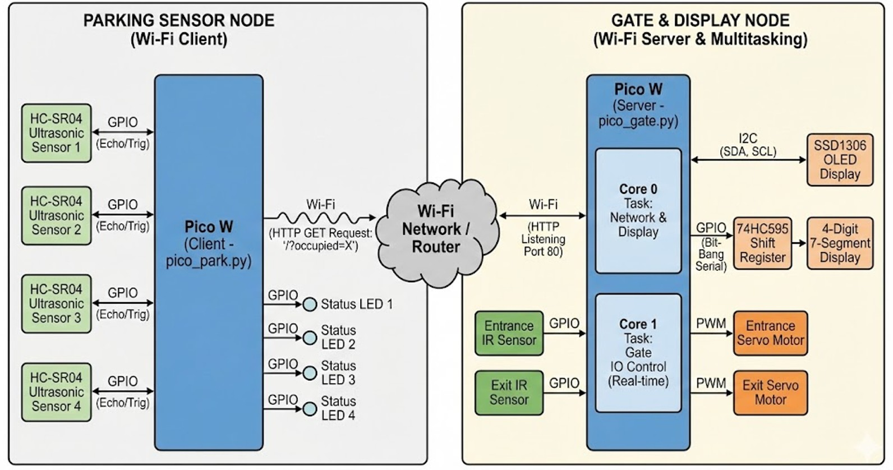

One board controls the parking sensors and acts as the client, sending HTTP GET requests to the other board, which acts as the central server. Once data is received from the client, the central server will update the displays and motors.

## 7-Segment Display Characters

Since the 7-segment display is only used to show the word "FULL', we included just the bytes needed to make that specific word. However, you can easily add more characters and numbers by adding their respective bytes to the [segment_font.py](https://github.com/kyriosaa/picopark/blob/main/code/pico_gate/segment_font.py) file.

```python
# For example, if you'd like to add numbers:

0b00111111, # 0
0b00000110, # 1
0b01011011, # 2
0b01001111, # 3
0b01100110, # 4
0b01101101, # 5
0b01111101, # 6
0b00000111, # 7
0b01111111, # 8
0b01101111  # 9

# 0 represents LED segments that are OFF
# 1 represents LED segments that are ON
```

## Features

| Feature | Description |
| --- | --- |
| **Real-time Occupancy Tracking** | Monitors parking spots and updates the central system instantly |
| **Smart Gate Control** | Gates open automatically for cars but will lock once the parking lot is full |
| **Visual Feedback** | OLED screen displays current spot count (e.g., "2/4"), and a 7-segment display warns "FULL" when capacity is reached |
| **Spot Status Indicators** | LEDs at each parking spot light up to indicate occupancy status. |
| **Wireless Communication** | Distributed system where the sensor node communicates with the gate controller over WiFi using HTTP |
| **Dual-Core Processing** | Uses the Raspberry Pi Pico 2 W's two cores to prevent blocking functions from slowing down the system |

## Hardware

| Component | Description |
| --- | --- |
| **Raspberry Pi Pico 2 W** | The system microcontrollers. One controls the parking sensors and the other controls the displays & gate. They communicate with each other using HTTP |
| **HC-SR04 Ultrasonic Sensor** | Used to sense if a car is parked in a spot or not |
| **LEDs** | Lights up when a car is parked in a spot |
| **MH Flying-Fish IR Sensor** | Senses if a car has driven up to the gate |
| **SG90 Servo Motor** | Lifts up the gate barriers when the IR sensors detect a car at the gate |
| **0.96" OLED Display** | Displays the occupied spots counter |
| **4-Digit 7-Segment Display** | Shows the word "FULL" when there's no more free parking spots |
| **74HC595 Shift Register** | Allows us to use multiplexing so we can control the 7-segment display using only 3 pins instead of 24 |
| **2N3906 Transistor** | Used to manage the power supply to the 7-segment display. Since the Raspberry Pi Pico 2 W's pins can only handle around 20-40mA of power, if we decide to turn on all the LEDs, it will draw around 160mA of power from EACH digit, meaning it will destroy the board. We put transistors in the middle to act as a low-power switch for the pico's pins instead, and the power to the 7-segment display will come from the main power supply |
| **220 Ohm Resistor** | Resistors for the 7-segment display LEDs |
| **1k Ohm Resistor** | Resistors for regulating the power coming from the power supply into the transistors |

> **Note:** Since the servo motors draw more power than the other sensors, their VCC pins are connected straight to the power supply instead of the 3V3 pin from the Raspberry Pi Pico 2 W.

## Images

> Project overview
> 

> Display + gate control & HTTP host
> 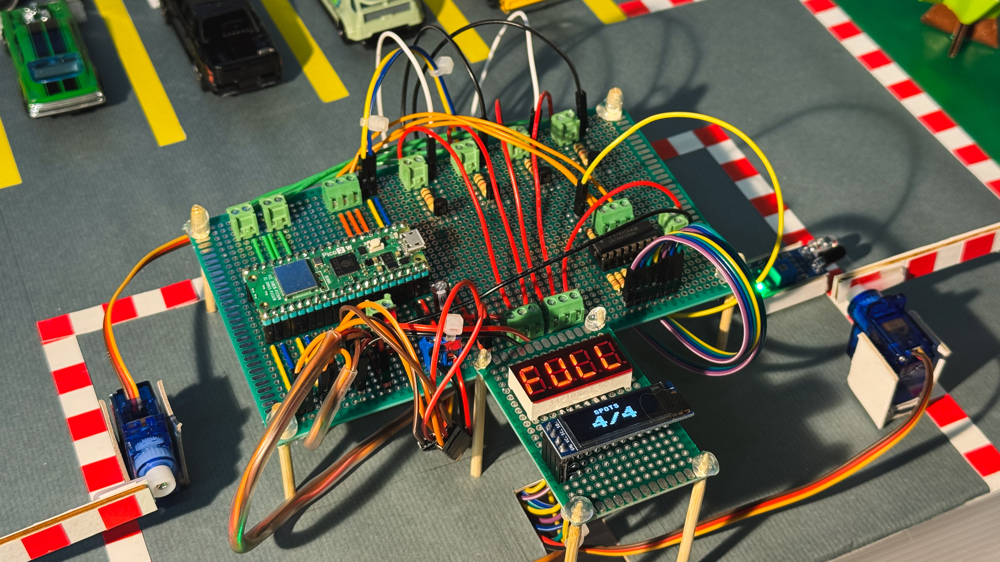

> Parking spots
> 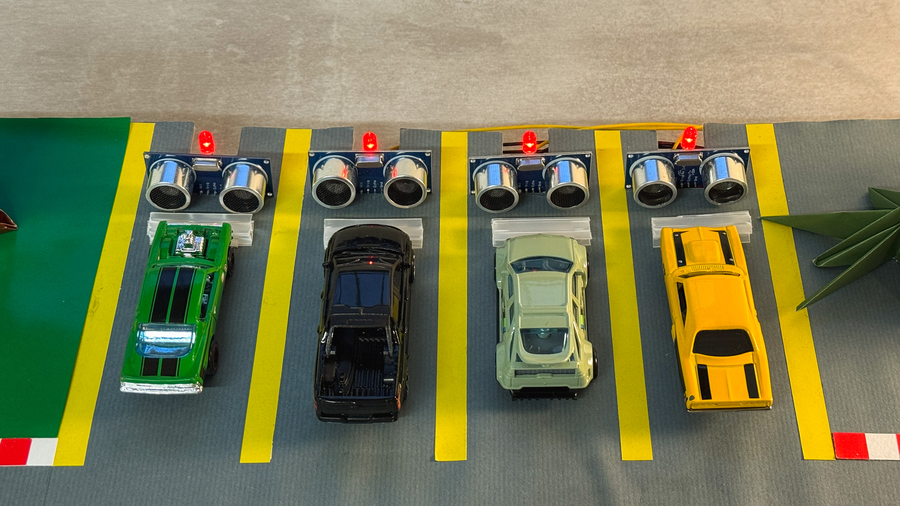

> Parking spots control & HTTP client
> 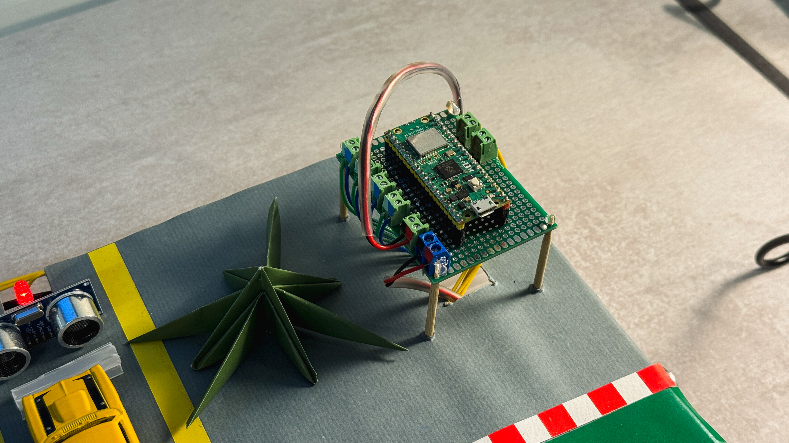

> Power source (supplies power to both Raspberry Pi boards at the same time)
> 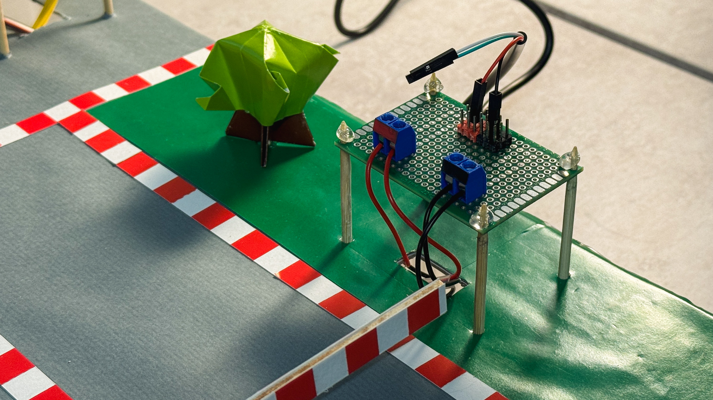

> Miscellaneous photos during the build process
> 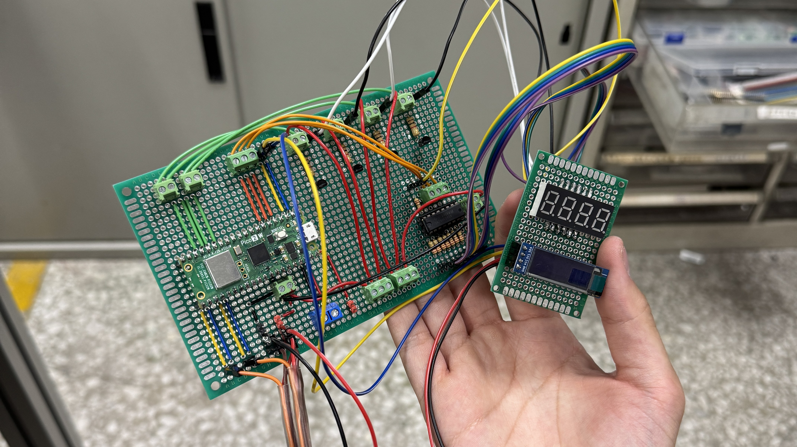
> 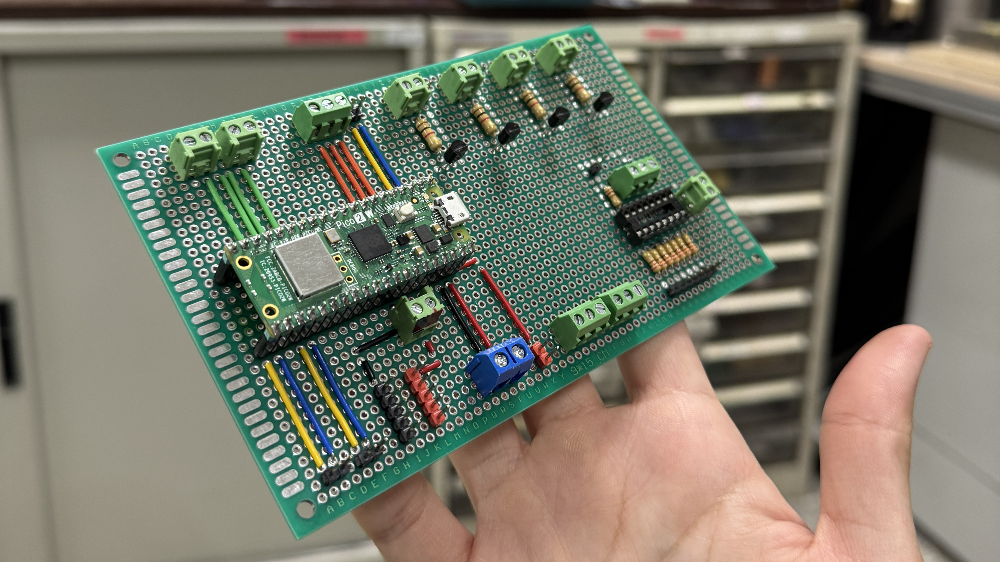
> 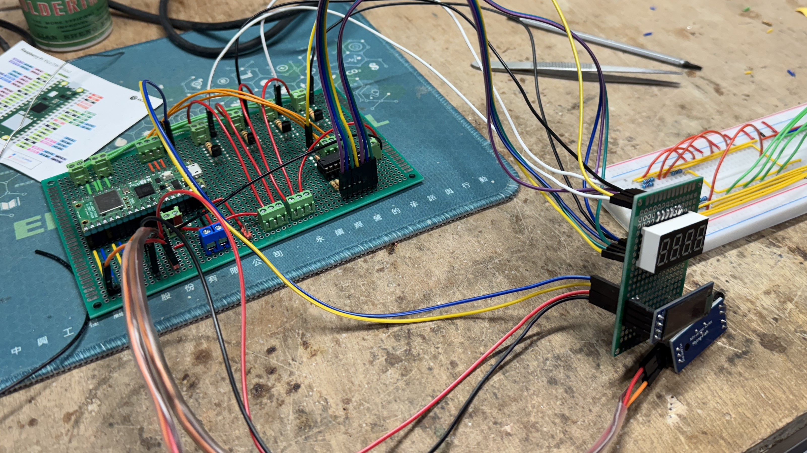
> 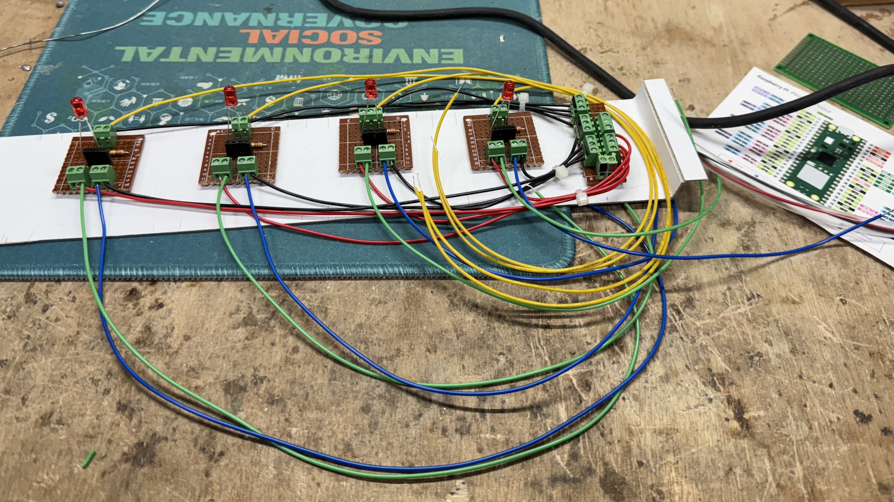
> 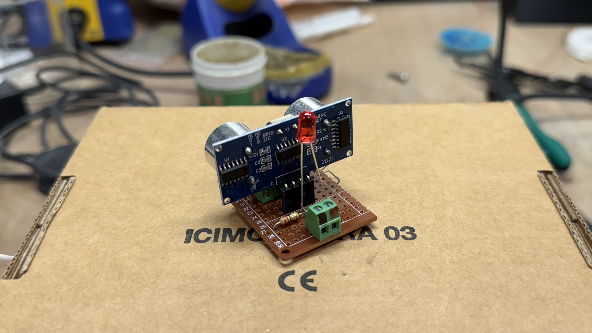
> 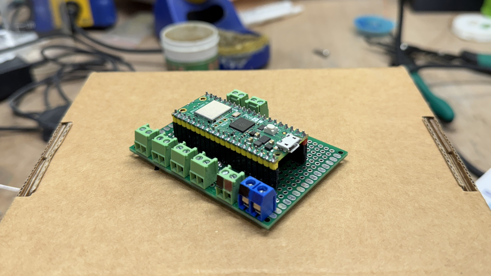
